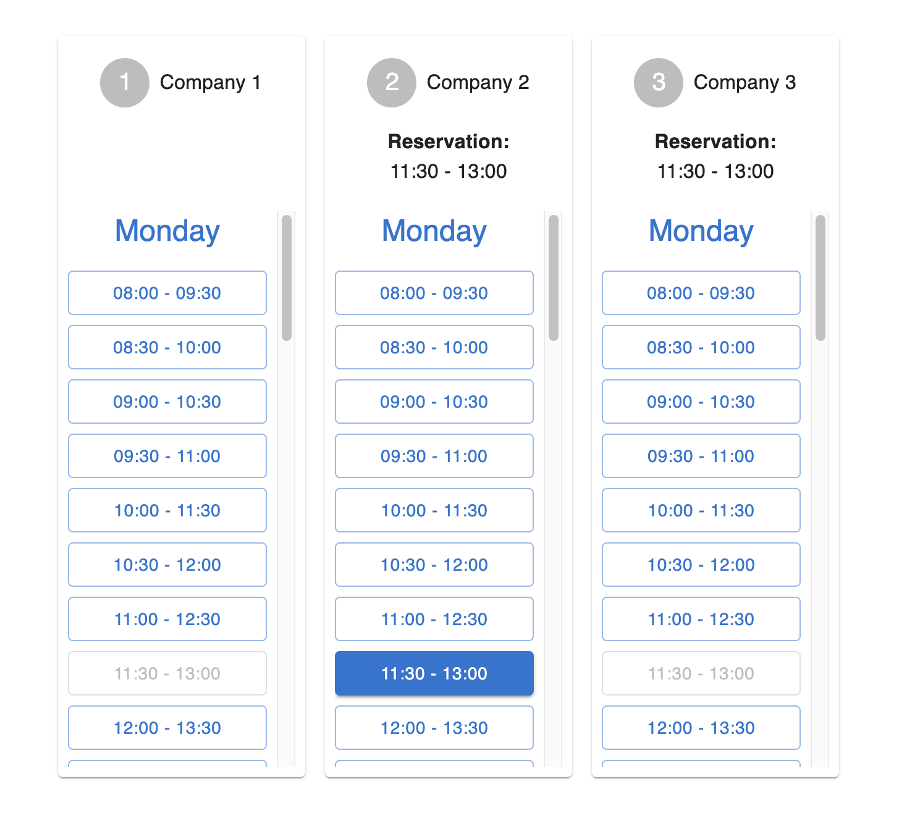

# Aroundhome demo

Time Slot manager for call center support hub built in NextJS.

- REST API for fetching ("external") data
- NextJS powered
- ✨ very easy to run, unfortunately couldn't finish some points ✨

## Tech

- [NextJS](https://nextjs.org/) - REST API and frontend application!
- [Momentjs](https://momentjs.com/) - Formatting Time slots
- [MUI](https://mui.com/) - React Library with styled-components (My favourite 🔥🔥🔥🔥🔥).
- [Axios](https://axios-http.com/) - Handle promises (very few of them but you never know 🤷)



## Getting Started

First install npm
```bash
npm install
```

Then, run the development server:

```bash
npm run dev
```

### API
```bash
 # getAllCompanies
GET /api/companies

 # getAllCompaniesById
GET /api/companies/[id]
```
Open [http://localhost:3000](http://localhost:3000) with your browser to see the result.

## Results

- [X]  Create a simple REST API that serves the time slots from the JSON file. Feel free to use an existing package that solves this task (e.g. json-server). The attached JSON file represents data of:
  - 3 companies
  - each company contains id, name, type and time_slots
  - each time_slot contains a start_time and end_time
  - start_time and end_time are represented in [ISO_8601](https://en.wikipedia.org/wiki/ISO_8601)
- [X]  Create a React application to fetch time_slots for companies from the api you created in step 1.
- [X]  Display the time_slots
  - [X]  in a human readable way (screenshot provided):
  - [X]  sorted by date and time
  - [X]  grouped by date
  - [X]  scrollable
- [X]  Allow users to set a reservation for a time_slot by
  - [X]  clicking on one of the time_slots
  - [X]  display the reservation above with the time of the selected time_slot
  - [X]  highlight the selected time_slot
  - [X]  allow to deselect a time_slot to remove the reservation
  - [ ]  only allow one reservation per company at once (🚨 WIP - unexpected behaviour 🚨)
- [X] Block all time_slots in the same time range for other companies
